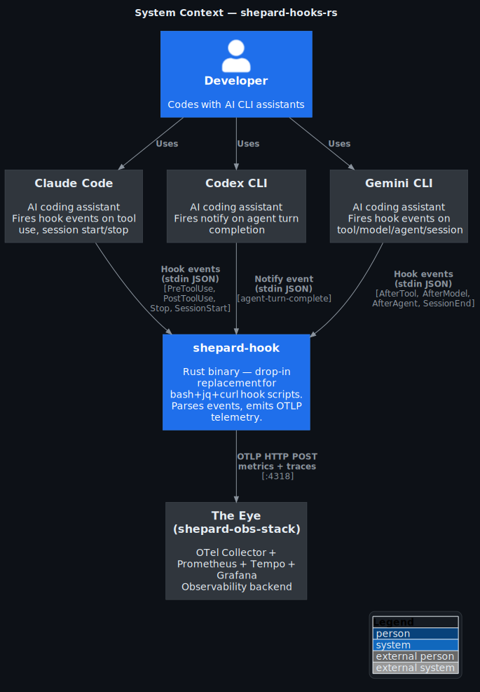
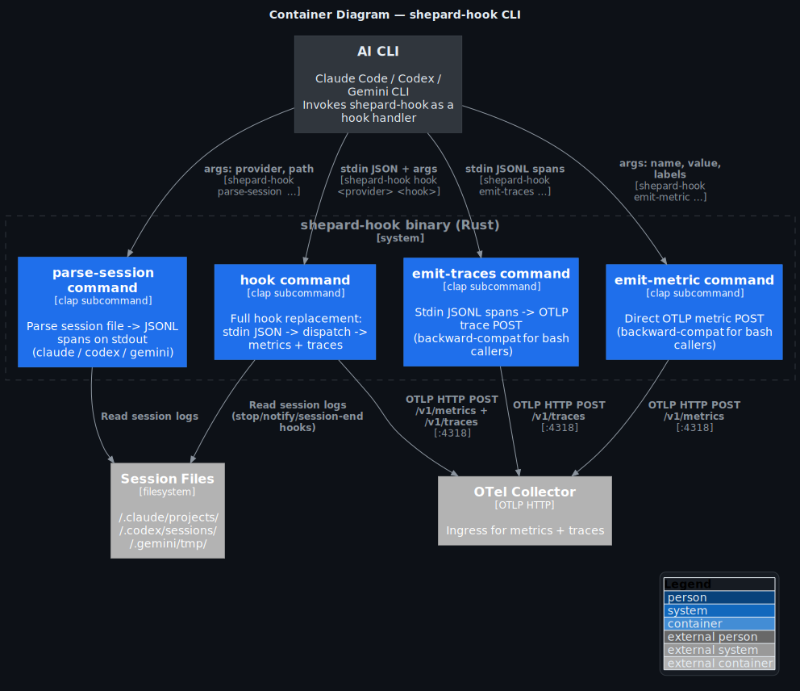
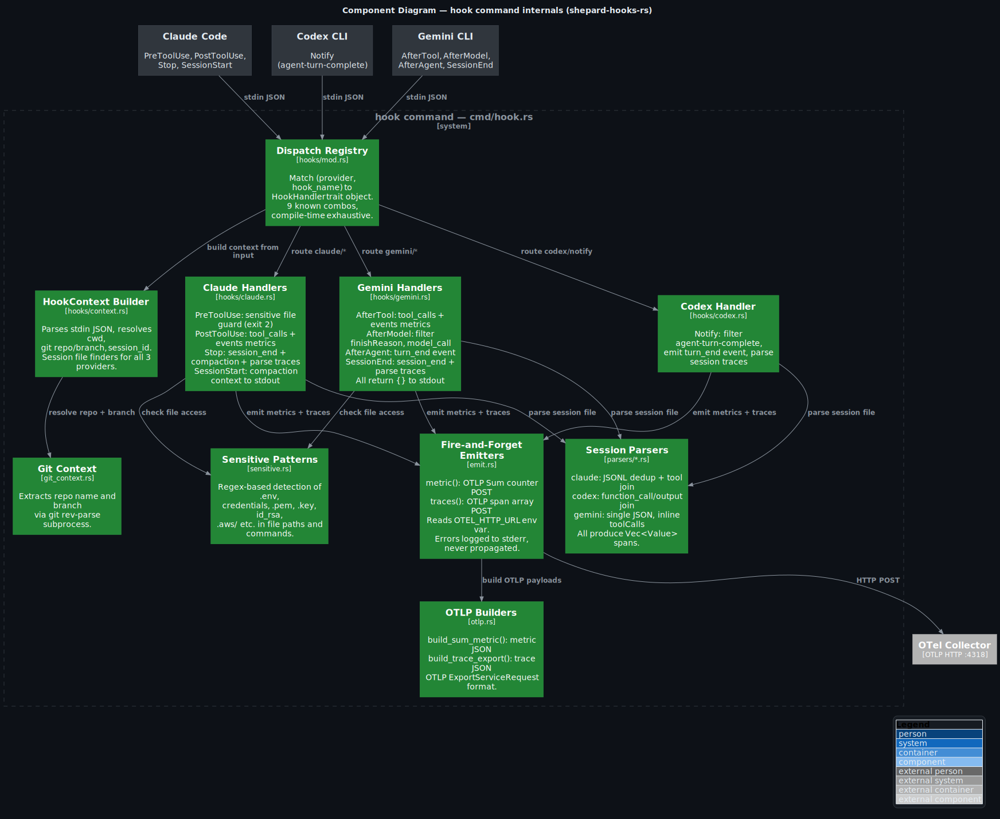
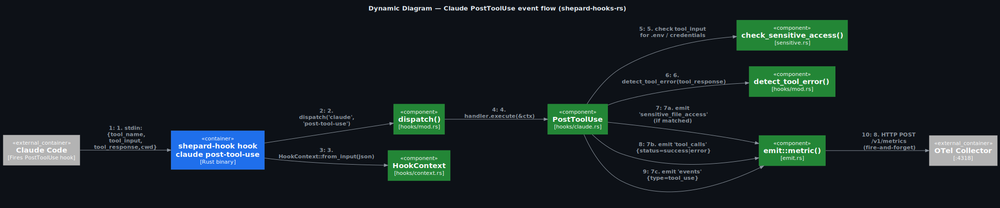

# shepard-hooks-rs

[](https://github.com/shepard-system/shepard-hooks-rs/actions/workflows/ci.yml)
[](https://github.com/shepard-system/shepard-hooks-rs/actions/workflows/release.yml)
[](https://www.rust-lang.org/)
[](https://github.com/shepard-system/shepard-hooks-rs/releases)
[](LICENSE)

**Rust accelerator for [shepard-obs-stack](https://github.com/shepard-system/shepard-obs-stack) hooks** — optional drop-in replacement for bash+jq+curl hook scripts.

A single `shepard-hook` binary replaces 9 shell scripts, 3 session parsers, and all `jq`/`curl` invocations. If the binary is found (project-local or on PATH), hooks use it. If absent, fall back to bash+jq (zero breakage).

## Quick Start

**Prerequisites:** Rust 1.85+ (edition 2024), [shepard-obs-stack](https://github.com/shepard-system/shepard-obs-stack) running on localhost.

### Option A: Install via obs-stack (recommended)

```bash
cd shepard-obs-stack
./scripts/install-accelerator.sh           # downloads to hooks/bin/ (no sudo)
./scripts/install-accelerator.sh v0.1.0    # specific version
```

The binary lives inside the project at `hooks/bin/shepard-hook` — no system PATH modification needed.

### Option B: Build from source

```bash
git clone https://github.com/shepard-system/shepard-hooks-rs.git
cd shepard-hooks-rs
cargo build --release
cp target/release/shepard-hook ~/.local/bin/   # or anywhere on PATH
```

Pre-built binaries for Linux and macOS (x64 + ARM64) are available on the [Releases](https://github.com/shepard-system/shepard-hooks-rs/releases) page.

## Usage

### Full hook replacement (primary use case)

```bash
# Claude Code hooks call this instead of bash scripts:
echo '{"tool_name":"Read","tool_input":{"file_path":"/app/.env"}}' \
  | shepard-hook hook claude pre-tool-use
# → stderr: "Blocked: access to sensitive file /app/.env", exit 2

echo '{"tool_name":"Read","tool_input":{},"tool_response":"ok","cwd":"."}' \
  | shepard-hook hook claude post-tool-use
# → silent exit 0, metrics emitted to OTel Collector

echo '{}' | shepard-hook hook claude session-start
# → stdout: post-compaction context

echo '{}' | shepard-hook hook gemini after-agent
# → stdout: {}
```

### Individual commands (backward-compat)

```bash
# Parse a session file into JSONL spans
shepard-hook parse-session claude ~/.claude/projects/-path/session.jsonl

# Emit a counter metric
shepard-hook emit-metric tool_calls 1 '{"source":"claude-code","tool":"Read"}'

# Pipe parsed spans to trace emitter
shepard-hook parse-session claude session.jsonl \
  | shepard-hook emit-traces claude-code-session
```

## Supported Hooks

| Provider | Hook | Behavior |
|----------|------|----------|
| Claude | `pre-tool-use` | Sensitive file guard (blocks .env, credentials, .pem, etc. — exit 2) |
| Claude | `post-tool-use` | Emit `tool_calls` + `events` metrics, detect errors, check sensitive access |
| Claude | `stop` | Emit `session_end` event, count compactions, parse session traces |
| Claude | `session-start` | Return post-compaction context to stdout |
| Codex | `notify` | Filter `agent-turn-complete`, emit `turn_end`, parse session traces |
| Gemini | `after-tool` | Same as Claude post-tool-use (source=gemini-cli), return `{}` |
| Gemini | `after-model` | Filter by `finishReason`, emit `model_call`, return `{}` |
| Gemini | `after-agent` | Emit `turn_end`, return `{}` |
| Gemini | `session-end` | Emit `session_end`, parse session traces, return `{}` |

## Integration

The obs-stack hooks auto-detect the binary via `hooks/lib/accelerator.sh`:

```bash
# Resolution order:
# 1. hooks/bin/shepard-hook  (project-local, primary)
# 2. command -v shepard-hook (global PATH)
# 3. empty → bash fallback

# In every hook script:
source "${SCRIPT_DIR}/../lib/accelerator.sh"
if [[ -n "$SHEPARD_HOOK" ]]; then
    "$SHEPARD_HOOK" hook claude stop
    exit $?
fi
# ... bash fallback below
```

Install the accelerator:
```bash
cd shepard-obs-stack
./scripts/install-accelerator.sh    # downloads to hooks/bin/
# or
./hooks/install.sh                  # installs hooks + accelerator together
```

## Architecture

<details>
<summary>C4 diagrams (click to expand)</summary>

### System Context



### Container — CLI subcommands



### Component — hook internals



### Dynamic — PostToolUse event flow



</details>

## Project Structure

```
shepard-hooks-rs/
├── src/
│   ├── main.rs              # CLI entry (clap)
│   ├── cmd/                  # 4 subcommands
│   ├── hooks/                # HookHandler trait + 9 handlers
│   ├── parsers/              # 3 session parsers (claude/codex/gemini)
│   ├── emit.rs               # fire-and-forget OTLP POST
│   ├── otlp.rs               # OTLP JSON payload builders
│   ├── git_context.rs        # git repo/branch extraction
│   └── sensitive.rs          # sensitive file pattern detection
├── docs/c4/                  # C4 architecture diagrams (.puml + .svg)
├── scripts/render-c4.sh      # PlantUML → SVG via Docker
├── .github/workflows/        # CI (clippy + test) + Release (4 targets)
└── Cargo.toml                # edition 2024, LTO release profile
```

## Development

```bash
cargo build                    # debug build
cargo test                     # run all tests
cargo clippy -- -D warnings    # lint (must pass)
cargo build --release          # optimized (LTO + strip)
```

Environment variables:
- `OTEL_HTTP_URL` — OTel Collector base URL (default: `http://localhost:4318`)

## License

[Elastic License 2.0](LICENSE) — free to use, modify, and distribute. Cannot be offered as a hosted or managed service.

Part of the [Shepard System](https://github.com/shepard-system).
